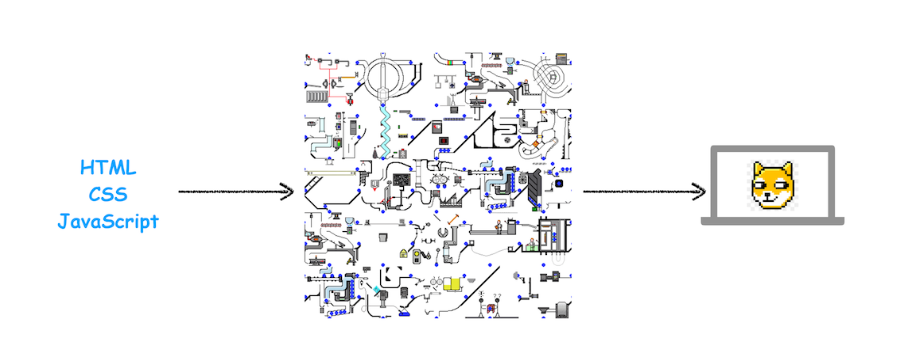
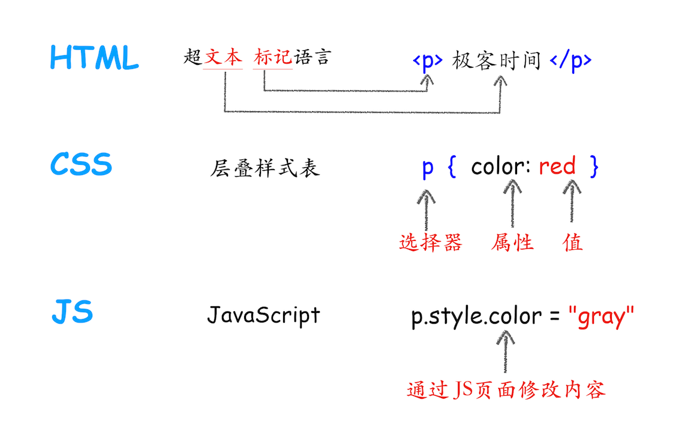
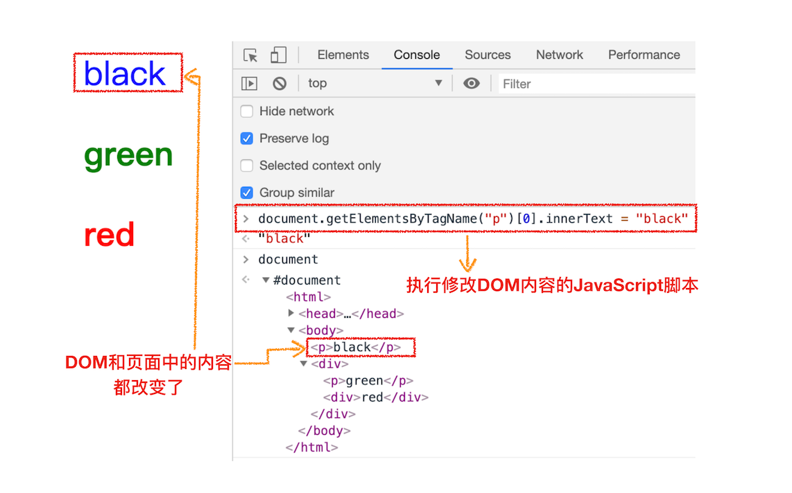
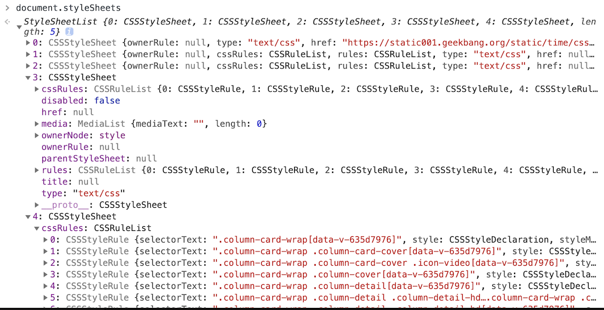
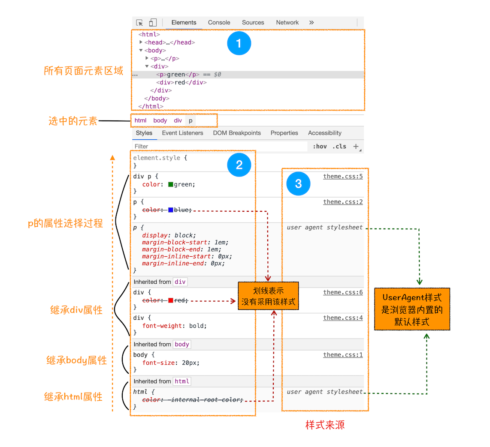
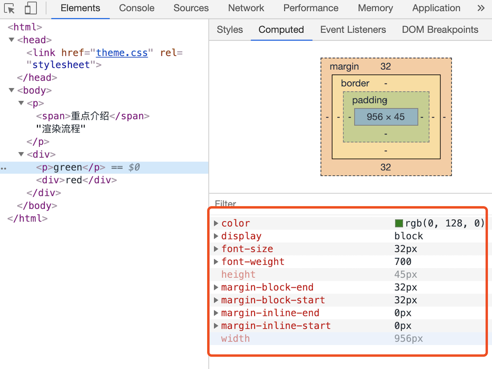
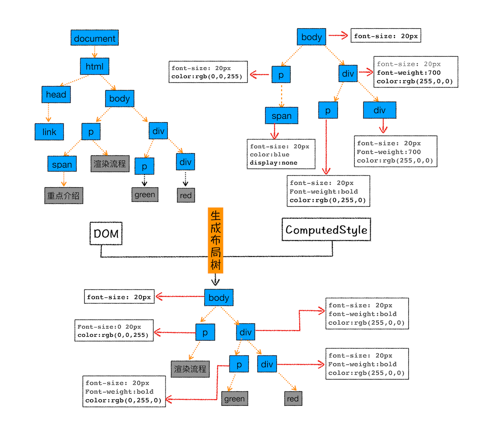

在上一篇文章中我们介绍了导航相关的流程，那导航被提交后又会怎么样呢？就进入了渲染阶段。这个阶段很重要，了解其相关流程能让你“看透”页面是如何工作的，有了这些知识，你可以解决一系列相关的问题，比如能熟练使用开发者工具，因为能够理解开发者工具里面大部分项目的含义，能优化页面卡顿问题，使用 JavaScript 优化动画流程，通过优化样式表来防止强制同步布局，等等。

既然它的功能这么强大，那么今天，我们就来好好聊聊**渲染流程**。

通常，我们编写好 HTML、CSS、JavaScript 等文件，经过浏览器就会显示出漂亮的页面（如下图所示），但是你知道它们是如何转化成页面的吗？这背后的原理，估计很多人都答不上来。


从图中可以看出，左边输入的是 HTML、CSS、JavaScript 数据，这些数据经过中间渲染模块的处理，最终输出为屏幕上的像素。

这中间的**渲染模块**就是我们今天要讨论的主题。为了能更好地理解下文，你可以先结合下图快速抓住 HTML、CSS 和 JavaScript 的含义：


从上图可以看出，**HTML 的内容是由标记和文本组成**。标记也称为**标签**，每个标签都有它自己的语义，浏览器会根据标签的语义来正确展示 HTML 内容。比如上面的标签p是告诉浏览器在这里的内容需要创建一个新段落，中间的文本就是段落中需要显示的内容。

如果需要改变 HTML 的字体颜色、大小等信息，就需要用到 CSS。CSS 又称为**层叠样式表，是由选择器和属性组成**，比如图中的 p 选择器，它会把 HTML 里面p标签的内容选择出来，然后再把选择器的属性值应用到p标签内容上。选择器里面有个 color 属性，它的值是 red，这是告诉渲染引擎把p标签的内容显示为红色。

至于 **JavaScript（简称为 JS），使用它可以使网页的内容“动”起来**，比如上图中，可以通过 JavaScript 来修改 CSS 样式值，从而达到修改文本颜色的目的。

搞清楚 HTML、CSS 和 JavaScript 的含义后，那么接下来我们就正式开始分析渲染模块了。

由于渲染机制过于复杂，所以渲染模块在执行过程中会被划分为很多子阶段，输入的 HTML 经过这些子阶段，最后输出像素。我们把这样的一个处理流程叫做**渲染流水线**，其大致流程如下图所示：


按照渲染的时间顺序，流水线可分为如下几个子阶段：构建 DOM 树、样式计算、布局阶段、分层、绘制、分块、光栅化和合成。内容比较多，我会用两篇文章来为你详细讲解这各个子阶段。接下来，在介绍每个阶段的过程中，你应该重点关注以下三点内容：
* 开始每个子阶段都有其输入的内容；
* 然后每个子阶段有其处理过程；
* 最终每个子阶段会生成输出内容。

理解了这三部分内容，能让你更加清晰地理解每个子阶段。

#### 构建 DOM 树
为什么要构建 DOM 树呢？**这是因为浏览器无法直接理解和使用 HTML，所以需要将 HTML 转换为浏览器能够理解的结构——DOM 树**。

这里我们还需要简单介绍下什么是**树结构**，为了更直观地理解，你可以参考下面我画的几个树结构：


从图中可以看出，树这种结构非常像我们现实生活中的“树”，其中每个点我们称为**节点**，相连的节点称为**父子节点**。树结构在浏览器中的应用还是比较多的，比如下面我们要介绍的渲染流程，就在频繁地使用树结构。

接下来咱们还是言归正传，来看看 DOM 树的构建过程，你可以参考下图：


从图中可以看出，构建 DOM 树的**输入内容**是一个非常简单的 HTML 文件，然后经由 HTML 解析器解析，最终输出树状结构的 DOM。

为了更加直观地理解 DOM 树，你可以打开 Chrome 的“开发者工具”，选择“Console”标签来打开控制台，然后在控制台里面输入“document”后回车，这样你就能看到一个完整的 DOM 树结构，如下图所示：


图中的 document 就是 DOM 结构，你可以看到，DOM 和 HTML 内容几乎是一样的，但是和 HTML 不同的是，DOM 是保存在内存中树状结构，可以通过 JavaScript 来查询或修改其内容。

那下面就来看看如何通过 JavaScript 来修改 DOM 的内容，在控制台中输入：
`
document.getElementsByTagName("p")[0].innerText = "black"`

这行代码的作用是把第一个
p标签的内容修改为 black，具体执行结果你可以参考下图：


从图中可以看出，在执行了一段修改第一个
p标签的 JavaScript 代码后，DOM 的第一个 p 节点的内容成功被修改，同时页面中的内容也被修改了。

好了，现在我们已经生成 DOM 树了，但是 DOM 节点的样式我们依然不知道，要让 DOM 节点拥有正确的样式，这就需要样式计算了。

#### 样式计算（Recalculate Style）
样式计算的目的是为了计算出 DOM 节点中每个元素的具体样式，这个阶段大体可分为三步来完成。

##### 1. 把 CSS 转换为浏览器能够理解的结构
那 CSS 样式的来源主要有哪些呢？你可以先参考下图：


从图中可以看出，CSS 样式来源主要有三种：
* 通过 link 引用的外部 CSS 文件
* style标记内的CSS
* 元素的 style 属性内嵌的 CSS

和 HTML 文件一样，浏览器也是无法直接理解这些纯文本的 CSS 样式，所以**当渲染引擎接收到 CSS 文本时，会执行一个转换操作，将 CSS 文本转换为浏览器可以理解的结构——styleSheets**。

为了加深理解，你可以在 Chrome 控制台中查看其结构，只需要在控制台中输入 document.styleSheets，然后就看到如下图所示的结构：


从图中可以看出，这个样式表包含了很多种样式，已经把那三种来源的样式都包含进去了。当然样式表的具体结构不是我们今天讨论的重点，你只需要知道渲染引擎会把获取到的 CSS 文本全部转换为 styleSheets 结构中的数据，并且该结构同时具备了查询和修改功能，这会为后面的样式操作提供基础。

##### 2. 转换样式表中的属性值，使其标准化
现在我们已经把现有的 CSS 文本转化为浏览器可以理解的结构了，那么**接下来就要对其进行属性值的标准化操作**。

要理解什么是属性值标准化，你可以看下面这样一段 CSS 文本：
```
body { font-size: 2em }
p {color:blue;}span {display: none}
div {font-weight: bold}
div p {color:green;}
div {color:red; }
```

可以看到上面的 CSS 文本中有很多属性值，如 2em、blue、bold，这些类型数值不容易被渲染引擎理解，所以**需要将所有值转换为渲染引擎容易理解的、标准化的计算值**，这个过程就是属性值标准化。

那标准化后的属性值是什么样子的？


从图中可以看到，2em 被解析成了 32px，red 被解析成了 rgb(255,0,0)，bold 被解析成了 700……

##### 3. 计算出 DOM 树中每个节点的具体样式

现在样式的属性已被标准化了，接下来就需要计算 DOM 树中每个节点的样式属性了，如何计算呢？

**这就涉及到 CSS 的继承规则和层叠规则了。**

首先是 CSS 继承。**CSS 继承就是每个 DOM 节点都包含有父节点的样式**。这么说可能有点抽象，我们可以结合具体例子，看下面这样一张样式表是如何应用到 DOM 节点上的。
```
body { font-size: 20px }
p {color:blue;}
span {display: none}
div {font-weight: bold;color:red}
div p {color:green;}
```

这张样式表最终应用到 DOM 节点的效果如下图所示：


从图中可以看出，所有子节点都继承了父节点样式。比如 body 节点的 font-size 属性是 20，那 body 节点下面的所有节点的 font-size 都等于 20。

为了加深你对 CSS 继承的理解，你可以打开 Chrome 的“开发者工具”，选择第一个“element”标签，再选择“style”子标签，你会看到如下界面：


这个界面展示的信息很丰富，大致可描述为如下。

* 首先，可以选择要查看的**元素的样式（位于图中的区域 2 中）**，在图中的第 1 个区域中点击对应的元素，就可以在下面的区域查看该元素的样式了。比如这里我们选择的元素是`<p>`标签，位于 html.body.div. 这个路径下面。
* 其次，可以从样式来源（位于图中的区域 3 中）中查看样式的具体来源信息，看看是来源于样式文件，还是来源于 UserAgent 样式表。这里需要特别提下 UserAgent 样式，它是浏览器提供的一组默认样式，如果你不提供任何样式，默认使用的就是 UserAgent 样式。
* 最后，可以通过区域 2 和区域 3 来查看样式继承的具体过程。

以上就是 CSS 继承的一些特性，样式计算过程中，会根据 DOM 节点的继承关系来合理计算节点样式。

样式计算过程中的第二个规则是样式层叠。**层叠是 CSS 的一个基本特征，它是一个定义了如何合并来自多个源的属性值的算法。它在 CSS 处于核心地位，CSS 的全称“层叠样式表”正是强调了这一点**。关于层叠的具体规则这里就不做过多介绍了，网上资料也非常多，你可以自行搜索学习。

总之，样式计算阶段的目的是为了计算出 DOM 节点中每个元素的具体样式，在计算过程中需要遵守 CSS 的继承和层叠两个规则。这个阶段最终输出的内容是每个 DOM 节点的样式，并被保存在 ComputedStyle 的结构内。

如果你想了解每个 DOM 元素最终的计算样式，可以打开 Chrome 的“开发者工具”，选择第一个“element”标签，然后再选择“Computed”子标签，如下图所示：


上图红色方框中显示了 html.body.div.p 标签的 ComputedStyle 的值。你想要查看哪个元素，点击左边对应的标签就可以了。

#### 布局阶段
现在，我们有 DOM 树和 DOM 树中元素的样式，但这还不足以显示页面，因为我们还不知道 DOM 元素的几何位置信息。**那么接下来就需要计算出 DOM 树中可见元素的几何位置，我们把这个计算过程叫做布局**。

Chrome 在布局阶段需要完成两个任务：创建布局树和布局计算。

##### 1. 创建布局树
你可能注意到了 DOM 树还含有很多不可见的元素，比如 head 标签，还有使用了 display:none 属性的元素。所以**在显示之前，我们还要额外地构建一棵只包含可见元素布局树**。

我们结合下图来看看布局树的构造过程：


从上图可以看出，DOM 树中所有不可见的节点都没有包含到布局树中。

为了构建布局树，浏览器大体上完成了下面这些工作：
* 遍历 DOM 树中的所有可见节点，并把这些节点加到布局树中；
* 而不可见的节点会被布局树忽略掉，如 head 标签下面的全部内容，再比如 body.p.span 这个元素，因为它的属性包含 dispaly:none，所以这个元素也没有被包进布局树。

##### 2. 布局计算
现在我们有了一棵完整的布局树。那么接下来，就要计算布局树节点的坐标位置了。布局的计算过程非常复杂，我们这里先跳过不讲，等到后面章节中我再做详细的介绍。

在执行布局操作的时候，会把布局运算的结果重新写回布局树中，所以布局树既是输入内容也是输出内容，这是布局阶段一个不合理的地方，因为在布局阶段并没有清晰地将输入内容和输出内容区分开来。针对这个问题，Chrome 团队正在重构布局代码，下一代布局系统叫 LayoutNG，试图更清晰地分离输入和输出，从而让新设计的布局算法更加简单。

#### 总结
好了，今天正文就到这里，我画了下面这张比较完整的渲染流水线，你可以结合这张图来回顾下今天的内容。


从图中可以看出，本节内容我们介绍了渲染流程的前三个阶段：DOM 生成、样式计算和布局。要点可大致总结为如下：
* 浏览器不能直接理解 HTML 数据，所以第一步需要将其转换为浏览器能够理解的 DOM 树结构；
* 生成 DOM 树后，还需要根据 CSS 样式表，来计算出 DOM 树所有节点的样式；
* 最后计算 DOM 元素的布局信息，使其都保存在布局树中。

到这里我们的每个节点都拥有了自己的样式和布局信息，那么后面几个阶段就要利用这些信息去展示页面了，由于篇幅限制，剩下的这些阶段我会在下一篇文章中介绍。

#### 思考时间
最后，给你留个思考题：如果下载 CSS 文件阻塞了，会阻塞 DOM 树的合成吗？会阻塞页面的显示吗？

当从服务器接收HTML页面的第一批数据时，DOM解析器就开始工作了，在解析过程中，如果遇到了JS脚本，如下所示：
```
<html>
    <body>
        极客时间
        <script>
        document.write("--foo")
        </script>
    </body>
</html>
```
那么DOM解析器会先执行JavaScript脚本，执行完成之后，再继续往下解析。

那么第二种情况复杂点了，我们内联的脚本替换成js外部文件，如下所示：
```
<html>
    <body>
        极客时间
        <script type="text/javascript" src="foo.js"></script>
    </body>
</html>
```
这种情况下，当解析到JavaScript的时候，会先暂停DOM解析，并下载foo.js文件，下载完成之后执行该段JS文件，然后再继续往下解析DOM。这就是JavaScript文件为什么会阻塞DOM渲染。

我们再看第三种情况，还是看下面代码：
```
<html>
    <head>
        <style type="text/css" src = "theme.css" />
    </head>
    <body>
        <p>极客时间</p>
        <script>
            let e = document.getElementsByTagName('p')[0]
            e.style.color = 'blue'
        </script>
    </body>
</html>
```
当我在JavaScript中访问了某个元素的样式，那么这时候就需要等待这个样式被下载完成才能继续往下执行，所以在这种情况下，CSS也会阻塞DOM的解析。


所以JS和CSS都有可能会阻塞DOM解析，关于详细信息我们会在后面的章节中详细介绍。