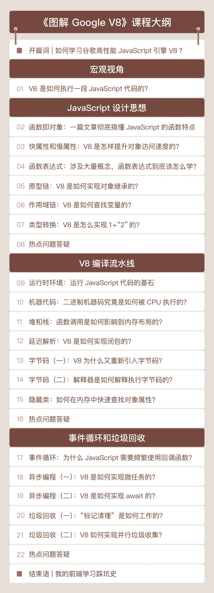

你好，我是李兵。在这个专栏中，我们对浏览器的工作原理进行了详细的介绍。

初期的浏览器，展示的只是一些静态页面，随着需要和页面交互的需求越来越多，JavaScript 就出现在了浏览器中，它让静态的页面动了起来。目前 JavaScript 已成为页面中最核心的一部分了，不过，JavaScript 作为一门高级语言，它的代码给到浏览器或者 Node.js 时，是不能直接被底层的 CPU 所执行的，这就需要通过 JavaScript 虚拟机来实现代码的编译和执行。

市面上有很多种 JavaScript 虚拟机，比如 SpiderMonkey、V8、JavaScriptCore 等，其中由谷歌开发的开源项目 V8 使用最为广泛。

V8 主要应用于 Google 开源浏览器 Chrome 中，它拥有非常庞大的生态圈，一方面得益于全球 25 亿台安卓设备上的 Chrome 浏览器，另一方面，也和它的许多革命性设计分不开。

比如，V8 摒弃了导致 JavaScript 执行速度过慢的解释执行方式，率先采用了即时编译（JIT）的双轮驱动的设计，混合了编译执行和解释执行两种方式。JIT 作为一种权衡策略，大幅优化了 JavaScript 代码的执行效率，也将 JavaScript 虚拟机技术推向了一个全新的高度。

作为 JavaScript 程序员，你可能并不会去实现一个 JavaScript 虚拟机，不过我们还是有必要理解 JavaScript 虚拟机工作机制的，你可以从中学习到很多优化性能的方法，帮你写出更高效的 JavaScript 代码。

所以，我回到极客时间做了第二季专栏[《图解 Google V8》](https://time.geekbang.org/column/intro/296?utm_term=zeusOVYAE&utm_source=app&utm_medium=geektime&utm_campaign=296-presell&utm_content=liulanqizhuanlan0316&tab=catalog)。在这一季里，我会专门讲讲 V8 的工作原理，帮你完整梳理 V8 的核心知识体系。在讲述方式上，我仍然延续这一季的风格，通过大量图片演示，深入浅出地讲解 V8 执行 JavaScript 代码的底层机制和原理。

希望通过这门课程，带你了解完整的 V8 编译流水线，同时通过对 V8 工作机制的学习，搞懂 JavaScript 语言的核心特性，进而从根源解决程序问题，加快 JavaScript 的执行速度。

下面是专栏的目录：

